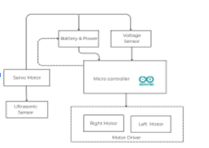
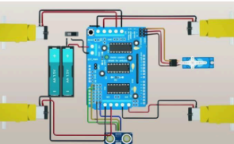

# PROJECT_SAFEBOT
**SafePath Bot: Machine Learning–Based Blockage Detection for Emergency Exit Paths**

---

Project Purpose
SafePath Bot is a low-cost mobile robotic system designed to monitor emergency exit paths and detect potential blockages in indoor environments such as schools, offices, and public facilities. The system classifies exit paths as **Clear**, **Partially Blocked**, or **Blocked** using sensor-based machine learning and robotics **without using cameras**. This helps improve evacuation readiness and reduces reliance on manual inspection.

---

## 2. Technologies Used

### Hardware
- Arduino Uno
- LAFVIN 2WD Robot Chassis
- Ultrasonic Sensor (HC-SR04)
- Infrared Sensors (2x)
- Motor Driver Shield (L293D)
- DC Motors
- Battery Pack (18650 Li-ion)

### Software / Tools
- Arduino IDE
- Python (offline model training)
- Scikit-learn (Decision Tree Classifier)

### Machine Learning Approach
- Supervised learning using labeled sensor readings
- Decision Tree classifier trained offline
- Extracted decision rules deployed on Arduino for real-time classification

---

Proponents (Leader and Members)
**Project Leader:**  
- Arabella Marrie Dotaro 

**Members:**  
- Cherry-Mae B. Agan  
- Jan Bartolomew Ege   
- Rahman Mangbisa  
- Yousef Saripada  

---

Block Diagram (System Overview)

### Block Diagram

### Circuit Diagram

---

🎥 **Demo Video:** https://drive.google.com/file/d/1DL_m_E2PHGZtrc-k0l9TsQgniH7Fy5Ov/view?usp=sharing
